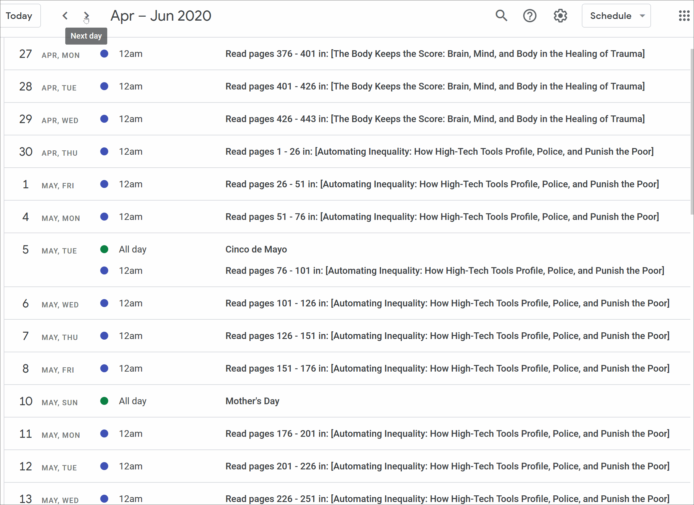

## Ro's Reading Scheduler

### Background
I made a goal to read 20 books minimum in 2020 and for me, a goal without a plan won't work. So, at 10pm on December 31, 2019, after looking up "reading schedule generators" and finding nothing I could use for my purposes, I set off to create a script that would add events on my Google calendar to remind me what pages I need to read on a given day.

### Requirements & Tasks
I had the following requirements:
- Tell me which book to read
- Tell which pages in said book to read
- Make sure the page range is readable in X amount of time (an hour, for me, during commute)
- Remind me on a set day (only weekdays)

To do this I needed to:
- Find a way to import the books I wanted to read in and in a specific order (the manual part)
- Create a file that contained the title of each book with corresponding page ranges and their dates to be read
- Connect to the Google Calendar API to create calendar events

### Result 
A couple of hours of tinkering later and we end up here: a Google calendar populated (using the Google Calendar API) with all the books I want to read for the year, in my desired order, 5 days a week, for the entire year! 

I have the ability to move around the events to days that are better for me with Google calendar integration. If Goodreads had something like this, it would be amazing!



### Contribute & Disclaimer

This is a _highly_ personal script (lots of toddler books in here because who can figure them out, amirite?) and was intended for my purposes only. Please do fork and use/contribute as you'd like.

**Here's how you can contribute and make this better (AKA what I'd like to do better):**

- [ ] Change date objects in `schedule_list.py` so the Google Calendar API can accept it and create all-day events instead of specifically timed events.
- [ ] Improve performance by implementing a pattern for "learn" and "fun". Essentially, if we know a book is 200+ pages, we already know what the page ranges up until page 200 will be and we will only need to do some short logic for the remaining range(s).
- [ ] Create a front-end so I can change the order of the books I want to read and import from Goodreads API instead of manually creating a CSV file
- [ ] Track reading progress in said UI and send to Goodreads (possibly?)
- [ ] Account for holidays in the schedule creator

You can fork and clone the repo to play around with this or run it for yourself by following the steps below.

## Set Up

_*This project uses Python 3_

1. Fork the repo and clone it to your local machine

 `git clone YOUR_FORKED_REPO_URL`

2. `Cd` to the folder where you cloned the project

3. Start virtual environment 

`source env/bin/activate`

4. Install the requirements 

`pip3 install -r requirements.txt`

If you just want to play around with the code and data, you can stop here.

If you want to make the script work for *you*, follow these steps...

## Extreme Set Up

You'll need to first edit and overwrite the `books.csv` file in the `./data` folder. 

*CSV Data Columns*:
- The _order_ column is the order in which you will read each book with "1" being the first book, and "20" being the last book, in my case. 
- The _type_ column defines what kind of reading each book is. I defined "fun" books as ones I'll read for leisure and "learn" as ones I'll probably take more time with notes and highlighting. The speed will affect how quickly I can get through a book (although speed is not the goal).

Next, log into the [Google API Dashboard](https://console.developers.google.com/apis/dashboard), create or use an existing project, enable or manage the Google Calendar API, and create an OAuth 2.0 client ID credentials.

Once those credentials are created, download the respective JSON file from the dashboard and save it to the root folder of the cloned project as `credentials.json`. You will not see this file publically because it is an ignored file (credentials need to stay a secret).

Then, change the `start_date` in `schedule_list.py` to the day you'll start your schedule and change `calendar_name` in `gcal_api.py` to your desired calendar name.

Finally, run the following commands to create a new Google calendar with the above name and generate events for the books in your list:

```
chmod u+x run-me
./run-me
```

You will then see the message below to click on a link to authenticate and authorize the script to make edits on your behalf.:
```
Please visit this URL to authorize this application: https://accounts.google.com/o/oauth2/auth?response_type=code&client_id=...
```

Choose the email address you'd like to create the calendar and events under and sign in. 

You'll see a list of event links being generated in the terminal. This could take some time depending on the number of events.

*Note that only "create" functions are used in this script, not delete. If you have already created a calendar, you will need to manually delete it from your Google Calendar list and run the bash script again.*

#### Troubleshooting

- If you are on Windows, you may need to run `sudo apt-get install dos2unix` to convert the bash script to Unix format and run `dos2unix run-me`.

- If you get an "app not verified message" in the browser after navigating to the login link, you can safely continue (or not, up to you). This is giving full edit, write, and delete rights to this script. 
